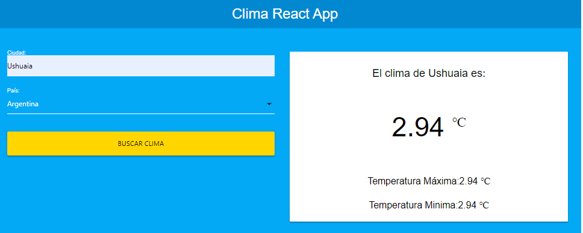

# Clima App

### App to search wather information

This is a project for practice frontend development.

## Area

- [x] Frontend
- [ ] Backend.

## Deploy

- [x] Local.
- [ ] Heroku.
- [ ] AWS.
- [ ] Netlify.
- [ ] None.

## <a name="table-of-contents"></a>Table of Contents

- [Instalation](#installation)
- [Images](#images)
- [Technologies](#technologies)

## <a name="installation"></a>Instalation:

- Clone the repository or download
- Open whith editor
- Open Terminal
- Install dependencies:

```
npm install
```

- Run the app:

`npm start`

## <a name="images"></a>Images:



## <a name="technologies"></a>Technologies:

- React

## Project management software

- [ ] Trello:
- [ ] Jira:
- [x] None

## Agile methodology

- [ ] Scrum
- [ ] Kanban
- [x] Not applied

## CI/CD

- [ ] Applied
- [x] Not applied

## AWS(services)

- [ ] Applied
- [x] Not applied

## Docker

- [ ] Apllied
- [x] Not applied
